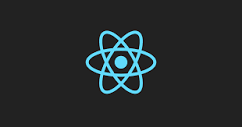
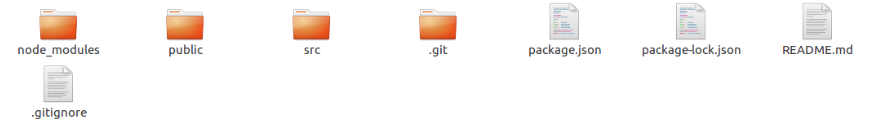
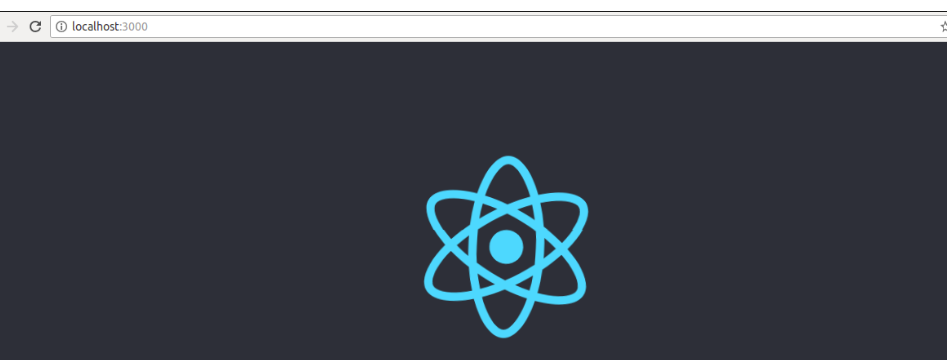
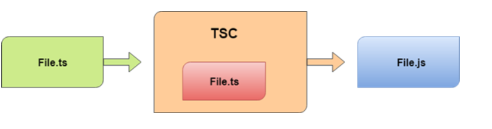

<h1  style="color:blue;">Supporting Document: React </h1>

<hr>

# Introduction to React

<p><code>ReactJS</code> is a declarative, efficient, and flexible JavaScript library for building reusable UI components. It is an open-source, component-based front end library responsible only for the view layer of the application.A ReactJS application is made up of multiple components, each component responsible for outputting a small, reusable piece of HTML code. The components are the heart of all React applications. These Components can be nested with other components to allow complex applications to be built of simple building blocks. ReactJS uses virtual DOM based mechanism to fill data in HTML DOM.</p>

<p>To create <code>React app</code>, we write React components that correspond to various elements. We organize these components inside higher level components which define the application structure. For example, we take a form that consists of many elements like input fields, labels, or buttons. We can write each element of the form as React components, and then we combine it into a higher-level component, i.e., the form component itself. The form components would specify the structure of the form along with elements inside of it.</p>

#### React uses virtual DOM based mechanism to fill data in HTML DOM. The virtual DOM works fast as it only changes individual DOM elements instead of reloading complete DOM every time.

# React Environment Setup

We will learn how to set up an environment for the successful development of ReactJS application.

## Pre-requisite for ReactJS

1. NodeJS and NPM
2. React and React DOM

## Ways to install ReactJS

1. Using the npm command

2. Using the create-react-app command

   Note: We are using the second way of installing and creating the React JS Application. And before start creating the React App, We have listed out some commands to know the version of the Node and NPM.

   

   ```react
   // To find the version of Node and NPM
    node -v // shows the current installed version of node
    npm -v  // shows the currrent installed version of npm 
   ```

   

             ###       Using the create-react-app command

You can install React using npm package manager by using the below command. There is no need to worry about the complexity of React installation. The create-react-app npm package will take care of it.

1. Node version >= 8.10
2. NPM version >= 5.6

- Move to the directory in which you wish to create your react app

  ```shell
  C:\Users\PT38475> 
  > mkdir myReactApp
  > C:\Users\PT38475\myReactApp> 
  ```

- Now, run the following command to create your first React Application

  ```nginx
  /* [Enter_App_Name] is basically the Application Name you wish to keep */
  > npx create-react-app [Enter_App_Name] 
  
  ```

  The above command will install the react and create a new project with the name of App. This app contains the following sub-folders and files by default which can be shown in the below image.

  <div style="border: solid 10px #0000 "></div>

Now, to get started, open the **src** folder and make changes in your desired file. 

<p>In React application, there are several files and folders in the root directory. Some of them are as follows:</p>

1. **node_modules:** It contains the React library and any other third party libraries needed.
2. **public:** It holds the public assets of the application. It contains the index.html where React will mount the application by default on the <div id="root"></div> element.
3. **src:** It contains the App.css, App.js, App.test.js, index.css, index.js, and serviceWorker.js files. Here, the App.js file always responsible for displaying the output screen in React.
4. **package-lock.json:** It is generated automatically for any operations where npm package modifies either the node_modules tree or package.json. It cannot be published. It will be ignored if it finds any other place rather than the top-level package.
5. **package.json:** It holds various metadata required for the project. It gives information to npm, which allows to identify the project as well as handle the project?s dependencies.
6. **README.md:** It provides the documentation to read about React topics.


### **Running the Server**

After completing the installation process, you can start the server by running the following command.

```nginx
> npm start
```

It will show the port number which we need to open in the browser. After we open it, you will see the following output.

<div style="border: solid 10px #0000 "></div>

## Components

<p>ReactJS is all about components. ReactJS application is made up of multiple components, and each component has its own logic and controls. These components can be reusable which help you to maintain the code when working on larger scale projects.</p>

<p>In this documentation we are going to use MUI theme and components for our implementation of components as <code>Button</code>, <code>CheckBox</code>, <code>Radio Buttons</code>,<code>Tabs</code> ,<code>Calander</code>,  <code>Grids</code> .</p>

#### Material UI - Overview

Material UI is an open-source React component library that implements Google's [Material Design](https://material.io/).

It includes a comprehensive collection of prebuilt components that are ready for use in production right out of the box.

Material UI is beautiful by design, and features a suite of customization options that make it easy to implement your own custom design system on top of our components. For detailed information, please visit to [Official MUI Page](https://mui.com/material-ui/).

###### Installation

**<code>npm</code>**

To install and save in your `package.json` dependencies, run the command below using **npm**:

```nginx
npm install @mui/material @emotion/react @emotion/styled
```

Or **<code>yarn</code>**:

```nginx
yarn add @mui/material @emotion/react @emotion/styled
```


#### TypeScript Overview

<p>TypeScript is an open-source pure object-oriented programing language. It is a strongly typed superset of JavaScript which compiles to plain JavaScript. It contains all elements of the JavaScript. It is a language designed for large-scale JavaScript application development, which can be executed on any browser, any Host, and any Operating System. The TypeScript is a language as well as a set of tools. TypeScript is the ES6 version of JavaScript with some additional features.</p>

<div style="border: solid 10px #0000 "></div>

<p>TypeScript cannot run directly on the browser. It needs a compiler to compile the file and generate it in JavaScript file, which can run directly on the browser. The TypeScript source file is in ".ts" extension. We can use any valid ".js" file by renaming it to ".ts" file. TypeScript uses TSC (TypeScript Compiler) compiler, which convert Typescript code (.ts file) to JavaScript (.js file).</p>

- #### How to create a button component inside your react page using MUI?

  <code>Button</code>

  Buttons allow users to take actions, and make choices, with a single tap.Buttons communicate actions that users can take. They are typically placed throughout your UI, in places like:

  - Modal windows

  - Forms

  - Cards

  - Toolbars

    ```typescript
    import * as React from 'react';
    import Stack from '@mui/material/Stack';
    import Button from '@mui/material/Button';
    
    export default function BasicButtons() {
      return (
        <Stack spacing={2} direction="row">
          <Button variant="text">Text</Button>
          <Button variant="contained">Contained</Button>
          <Button variant="outlined">Outlined</Button>
        </Stack>
      );
    }
    
    ```

    

- #### How to create a checkbox component inside your react page using MUI?

  <code>Checkbox</code>

  Checkboxes can be used to turn an option on or off. If you have multiple options appearing in a list, you can preserve space by using checkboxes instead of on/off switches. If you have a single option, avoid using a checkbox and use an on/off switch instead.

  **Basic Checkbox **

  <div style="border: solid 10px #0000 "></div>

  ```typescript
  import * as React from 'react';
  import Checkbox from '@mui/material/Checkbox';
  
  const label = { inputProps: { 'aria-label': 'Checkbox demo' } };
  
  export default function Checkboxes() {
    return (
      <div>
        <Checkbox {...label} defaultChecked />
        <Checkbox {...label} />
        <Checkbox {...label} disabled />
        <Checkbox {...label} disabled checked />
      </div>
    );
  }
  
  ```

  **Label Checkboxes**

  <div style="border: solid 10px #0000 "></div>

  ```typescript
  import * as React from 'react';
  import FormGroup from '@mui/material/FormGroup';
  import FormControlLabel from '@mui/material/FormControlLabel';
  import Checkbox from '@mui/material/Checkbox';
  
  export default function CheckboxLabels() {
    return (
      <FormGroup>
        <FormControlLabel control={<Checkbox defaultChecked />} label="Label" />
        <FormControlLabel disabled control={<Checkbox />} label="Disabled" />
      </FormGroup>
    );
  }
  
  ```

  

  

- #### How to create a radio button component inside your react page using MUI?

- #### How to create a calendar component inside your react page using MUI?

- #### How to create a grid component inside your react page using MUI?

- #### How to create an input text-field inside your react page using MUI?

  
